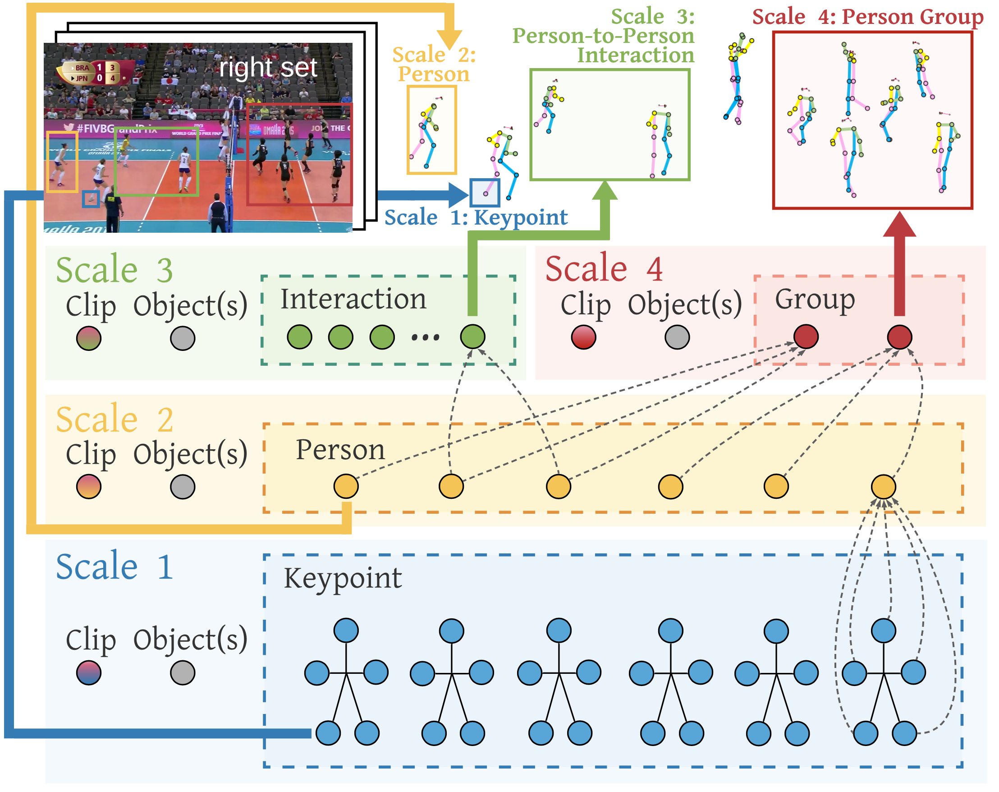

# COMPOSER: Compositional Reasoning of Group Activity in Videos with Keypoint-Only Modality
This is an official implementation of [COMPOSER: Compositional Reasoning of Group Activity in Videos with Keypoint-Only Modality](https://arxiv.org/abs/2112.05892). In this repository, we provide PyTorch code for training and testing as described in the paper. The proposed model COMPOSER exploits a contrastive clustering objective to  improve the intermediate representations and learns compositional reasoning at different scales for group activity recognition. COMPOSER achieves up to +5.4% improvement with just the keypoint modality.

If you find our repo useful in your research, please use the following BibTeX entry for citation.

```BibTeX
@article{zhou2022composer,
  title={COMPOSER: Compositional Reasoning of Group Activity in Videos with Keypoint-Only Modality},
  author={Zhou, Honglu and Kadav, Asim and Shamsian, Aviv and Geng, Shijie and Lai, Farley and Zhao, Long and Liu, Ting and Kapadia, Mubbasir and Graf, Hans Peter},
  journal={Proceedings of the 17th European Conference on Computer Vision (ECCV 2022)},
  year={2022}
}
```
<p align="middle">
    
</p>


# Installation
conda create -n composer python=3.7.6        
conda activate composer   
pip install torch==1.9.0+cu111 torchvision==0.10.0+cu111 -f https://download.pytorch.org/whl/torch_stable.html    
pip install pyyaml      
pip install opencv-python  
pip install scipy     
pip install tqdm     
conda install matplotlib     
conda install scikit-learn     
pip install numba      
    
       
To run COMPOSER on the Collective Activity dataset, kmeans-pytorch has to be installed. First, find a new directory to clone the following repo:    
git clone https://github.com/hongluzhou/kmeans_pytorch      
Then:    
cd kmeans_pytorch  
pip install --editable .      
You can run the following code to see if kmeans-pytorch has been succesfully installed:    
```python
import torch
import numpy as np
from kmeans_pytorch import kmeans

# data
data_size, dims, num_clusters = 13, 2, 3
x = np.random.randn(data_size, dims) / 6
x = torch.from_numpy(x)

# kmeans
cluster_ids_x, cluster_centers, cluster_iterations = kmeans(
    X=x, num_clusters=num_clusters, distance='euclidean', tqdm_flag=True, device=torch.device('cuda:0')
)
```

# Dataset Preparation
### Volleyball
Please refer to [this repo](https://github.com/mostafa-saad/deep-activity-rec#dataset) to obtain the raw files (such as video frames and annotations) of the Volleyball dataset. 
For convenience, we have also zipped and uploaded the Volleyball data folder that we used when we ran COMPOSER, and you can download the data using [this link](https://drive.google.com/file/d/1NF7aiplia3g5Ng5pARoYjS47wPz66XCx/view?usp=sharing). The file size is large though (62.23 GB).
The folder contains the following files and subdirectories:
- volleyball/
    - videos/
    - joints/
    - tracks_normalized.pkl
    - tracks_normalized_with_person_action_label.pkl
    - volleyball_ball_annotation/

Please see DATA_README.txt to understand the data formats, etc.    

### Olympic Split of Volleyball
To use the Olympic split of the Volleyball dataset, simply set `olympic_split` in the config yml file to be `True`.    

### Collective Activity
Please refer to [this website](https://cvgl.stanford.edu/projects/collective/collectiveActivity.html) for details on this dataset and obtaining the video frames.    
For easier reproducibility, we have zipped and uploaded the Collective Activity data folder that we used, and you can download the data using [this link](https://drive.google.com/file/d/1_KkKyweMZdnxtTByPebOgO1JVCMV_1Pa/view?usp=sharing).    
The folder contains the following files and subdirectories:
- collective/  
    - videos/
    - joints/
    - annotations.pkl
    - tracks_normalized.pkl
    - tracks_normalized_with_person_action_label.pkl
   
### Keypoint Extraction Using HRNet
We use [HRNet](https://github.com/leoxiaobin/deep-high-resolution-net.pytorch) for keypoint extraction, and the code we modified to perform keypoint extraction on the Volleyball dataset is available at [this repo](https://github.com/hongluzhou/hrnet_pose_extract).    

# Train
First, please modify `dataset_dir` in the config yml file to the path where you put the downloaded dataset.     
You can also change where you want to save the logs and checkpoints with `checkpoint_dir` and `log_dir`.     
If you want to use a different number of GPUs, please modify the `gpu` as well. The following means two gpus (gpu 0 and 1) will be used.    
```yaml
gpu:
  - 0
  - 1
```
 To start training COMPOSER on the original split of the Volleyball dataset:
```shell
python main.py train --mode train --cfg configs/volleyball_stage_1.yml
```
Then, take the checkpoint saved from the above command:
```shell
python main.py train --mode train --cfg configs/volleyball_stage_2.yml --load_pretrained 1 --checkpoint path_to_saved_checkpoint.pth
```
The differences between the two training stages are the learning rate and the number of epochs, and we have found this two-stage training worked better.

# Test
We release the checkpoints of our trained model (see details below). To use the trained COMPOSER model and perform testing:
```shell
python main.py test --mode test --cfg configs/volleyball_stage_2.yml --checkpoint checkpoints/composer_volleyball.pth
```
Note that the code requires some dataset statistics to be pre-computed and the statistics would be computed by the training code.     
Hence, if you do not want to train a full model and just want to use the relased checkpoints to perform testing, please run the above stage 1 training script first and stop the training once you see training has been started (i.e., printing the loss values).     
Then, you can start the testing (make sure`dataset_dir` in the config yml file is correct).    

# Checkpoints
Please download the checkpoints using [this link](https://drive.google.com/file/d/1rBQSoGS7MrhvDaPRtVi0TbZygoe63Fo_/view?usp=sharing). The following checkpoint files are provided:   
./checkpoints/  
├── composer_collective.pth   
├── composer_volleyball_olympic.pth   
└── composer_volleyball.pth   
  
